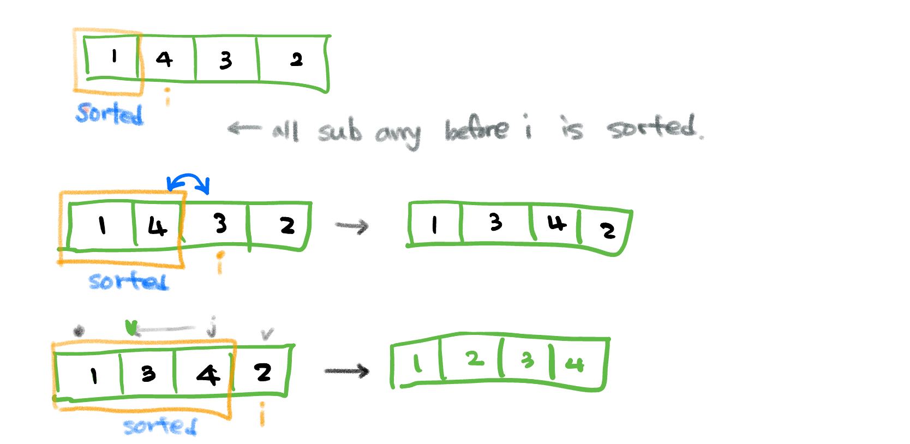

# Insertion Sort

## Overview
Insertion Sort is a simple and intuitive sorting algorithm that builds the final sorted array one element at a time. It is efficient for small datasets and partially sorted arrays.

## Algorithm
The algorithm works by iterating through the array and inserting each element into its correct position relative to the elements before it.

### Steps:
1. Start from the second element (index 1) in the array.
2. Compare the current element with the elements before it.
3. Shift all larger elements one position to the right.
4. Insert the current element into its correct position.
5. Repeat until the entire array is sorted.

### How it works?

## Time Complexity
- **Best Case**: \(O(n)\) (when the array is already sorted)
- **Worst Case**: \(O(n^2)\) (when the array is sorted in reverse order)
- **Average Case**: \(O(n^2)\)

## Space Complexity
- **Auxiliary Space**: \(O(1)\) (in-place sorting)

## Advantages
- Simple to implement.
- Efficient for small or nearly sorted datasets.

## Disadvantages
- Inefficient for large datasets due to \(O(n^2)\) time complexity.
